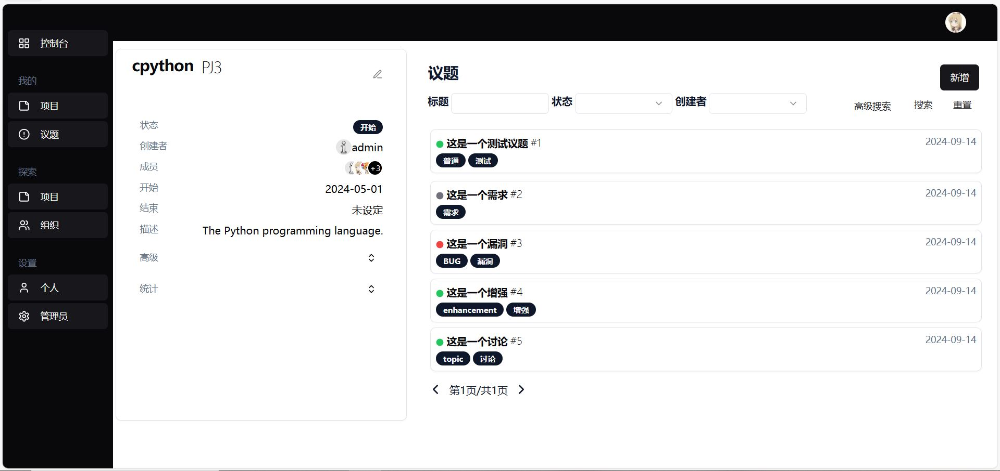

## issuer: 软件项目管理应用

issuer是一个面向非专业使用者的轻量级软件项目管理系统，类似市面上的禅道、PingCode，但是是完全开源的作品。本项目目的是让非专业使用者也可以轻松管理软件项目，控制软件开发风险。同时，本项目开发参考了禅道（试用版）、云效（旧Aone）和GitHub等优秀作品，但在此基础上也扩充自己独特功能，包括以下特点：

**完全开源**: 本项目完全由社区驱动（虽然现在只有我一个人），支持[MIT协议](./LICENSE)且永久承诺不包含任何商业成分，后续也不会新增付费内容。如果你觉得本项目有价值的话也欢迎加入共建。

**多方联动**: 本项目支持与各软件开发工具联动。目前可以通过Gitea钩子驱动项目迭代，后续考虑加入更多的联动支持，比如drone、jenkins等。

**响应页面**: 本项目通过 tailwindcss 实现响应式页面，可以在不同设备上正确展示页面信息。

### 基本功能

issuer分为三大部分——项目、议题和组织。其中项目是指软件工程项目，议题是针对各个项目提出的需求、BUG和特性，而组织是不同用户的集合。

#### 控制台和用户界面

用户登陆后直接进入“控制台”，并查看近期活动以及项目议题等基本数据。管理员发布的“通知”也可以在此查看。

用户界面展示了该用户的基本信息以及参与的项目和组织，后续会添加该用户的活动瓷砖图。

#### 项目管理

用户可以通过“我的项目”中的新增按钮创建项目。被创建的项目可以在“我的项目”中查看，也可以在“探索项目”中通过点击“＋”按钮加入已经创建好的项目。

创建项目的过程中必须指定“名称”和“开始日期”，其余为可选项。被创建的项目的管理者为当前用户，可以在“我的项目”、“探索项目”以及项目详情页中修改项目状态、信息等。

在项目详情页面内，用户不仅可以查看项目基本信息，还可以为该项目添加议题。在页面左侧，用户还可以在“高级”折叠栏中进一步设置项目，也可以通过“统计”折叠栏查看相关议题的统计信息。

#### 议题管理

用户可以直接项目详情页中点击“新增”按钮创建议题。议题必须提供标题和描述，并将展示在页面上。标签是可选项且为任意内容，用户输入标签后按下回车视为创建该标签。

用户可以点击项目详情页的议题进入议题详情页。

议题的创建者可以对议题的状态修改，其它用户可以对该议题发表评论。评论支持[Markdown](https://markdown.com.cn/basic-syntax/)语法。

#### 组织管理

用户可以点击右上角头像框新增组织。新建的组织可以在“探索组织”中查看，也可以通过点击“+”加入已创建的组织。目前组织和项目的关联性不大。

### 高级功能

#### 通过Gitea驱动项目进度

issuer可以通过代码托管平台Gitea驱动议题状态，完成需求的代码在Gitea平台提交后可以更新对应的issuer议题。

首先，用户需要在issuer中创建一个项目，并将高级折叠栏中的Gitea钩子URL复制下来。

其次，在Gitea平台上对应的代码仓库中添加钩子，类型选择`Gitea`。其中，目标URL填写先前复制的URL，其它保持默认不变。创建好后即可完成Gitea平台与issuer的关联。

> 首次创建Gitea钩子需要更新Gitea的全局配置，具体详见[官方文档](https://docs.gitea.com/administration/config-cheat-sheet)。

当开发者需要提交代码时，首先需要确保该议题已被创建好。

然后需要在提交的 __commit message__ 中指定目标议题序号。为了区别Gitea内部的issue，议题序号用`$`+序号表示。此外，开发者还可以附上补充链接（比如测试地址）。该链接也会被一起当作补充依据被渲染。

最后，可以看到issuer平台上的议题状态被更新，而且还附上了依据。用户可以点击链接查看该议题对应的代码变更。

### 构建

本项目通过`Makefile`构建，确保安装了`make`、`python`和`node`，命令如下：

- make init: 初始化项目，第一次运行本项目的时候执行
- make build-front: 编译前端项目
- make start: 运行项目

### 贡献

本项目处于开发初期阶段，欢迎感兴趣的开发者共建项目。本项目前端采用 react + tailwindcss + shadcn/ui，后端采用 fastapi + sqlmodel 等技术路线。
